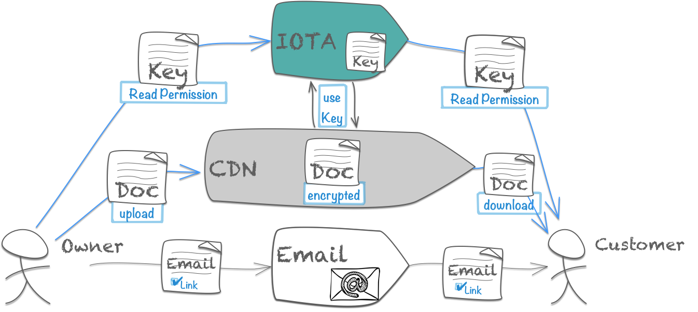

# IOTA/FileExchange

Secure document exchange with email+iota.

## Content

1. [Problem statement](#1)
2. [Market description](#2)
3. [A detailed overview of my proposed solution](#3)
 * [How IOTA is used in this use-case and what would be needed to achieve this solution](#3.1)
4. [Solutions and visions](#4)
 * [Long term solution (Vison)](#4.1)
 *  [Short term solution](#4.2)
5. [Fazit](#5)
6. [Links](#6)

## Problem statement <a name="1"></a>

What is the problem I'am trying to solve? 

I want to exchange secure documents with email+iota.


* to reduce letter shipping costs for companies 
* to reduce paper wast for the end customer (and the earth)
* to reduce portal-login-hell for the end customer

> 'portal-login-hell' is the fact that a lot of companies have a portal with login where they share documents to the customer. This portals needs a login. The end customer needs to handle this portal links+logins - the portal-login-hell.


## Market description <a name="2"></a>

What does the market look like? Where would you apply the use-case? Local? Regional? Worldwide?

> The market scope is worldwide every email user (theoretical)

**B2C market** 

* big companies they have a lot of document exchange with end customer 
* like banks and insurance companies 
* they want to reduce its shipping costs (assumption)

**C2C market**

* every email user who doesn't want share plain documents via email, slack or other untrusted services
* maybe 0,1% of the email user? - (its still a lot ~4 million user - [[source](https://www.lifewire.com/how-many-email-users-are-there-1171213)])

<div style="page-break-after: always;"></div>

## A detailed overview of my proposed solution <a name="3"></a>

Classical mail is the way to exchange documents in traditional way. Where everybody trusts the shipping service.

  

Email could not disrupt this traditional mail business yet. Because its intrinsic unsecure. The email is not designed for. All efforts 
to close this gap failed so far (e.g. smime or pgp) - because the setup is to complex for the end customer.

A lot of companies try to fits this gap through a own portal, where the customer get secure access to the documents from this company. 
These tends to portal-login-hell. I as customer must manage a lot of logins to different portals which I serve very rarely.

> I wants to fits this gap with email+iota.



* the encrypted documenten will shared over a Contend Delivery Network (CDN)
* the permission keys will be sahred over iota
* the link to ducument will be shared with email

This triangle garante a secure way to share documents with the overall accepted technology email. 

<div style="page-break-after: always;"></div>

### How IOTA is used in this use-case and what would be needed to achieve this solution <a name="3.1"></a>

IOTA is used to exchange permission and document information. Both (permissions and documents) are identifiable transactions in the tangle. 
They can be created, moved and managed with IOTA instruments.  


Imagin that IOTA serves a SmartContract:=FileExchange. For every uploaded File will a FileExchange instance created in the tangle. 
The purpose of the FileExchange instance is permission handling and the documentation of the lifecycle (upload, permission grants, download, etc).

The FileExchange Contract

* has an identity (iota-token)
* has an resource (link to encrypted byte stream)
* has an symetric key (aes) to en/decrypt the content
* has 2+ permissions - (1) _own-permission_ from the user who upload the FILE_TO_UPLOAD. (2) _read-permission_ from the user who wants to download the document

The permissions are RAS key pairs (private and public). A permission 

* have also an identity (iota-token). 
* they can be moved between users over the tangle.

The detailed process is:

```
1 - A Owner upload a document to Content Delivery Network (CDN)
1.1 Create RSA key pair for the Owner to decrypt the AES key on CDN
1.2 Sent the RSA key pair to the owner ledger
1.3 Store the AES encrypted document 
1.4 Response the link to the encrypted document to the owner
2 - The owner grant a read permission to a Customer
2.1 Create RSA key pair for the Customer to decrypt the AES key (on customer side)
2.2 Sent the RSA key pair to the customer ledger
3 - The Owner send a email to the customer with the document link
4 - Customer download the encrypted dokument 
4.1 Customer fetch AES key (encrypted)
4.2 Decrypt encrypted AES key with customer private key (from read permission)
5 - Customer decrypt encrypted document with decrypted AES key
```

## Solutions and visions <a name="4"></a>

### Long term solution (Vison) <a name="4.1"></a>

Every people use IOTA/FileExchange for secure document exchange direct or indirect ()like email/messenger today). 
There exists multiple clients for any device, platform, tool and browser to use the IOTA/FileExchange. 

> IOTA/FileExchange is a brand. 

### Short term solution <a name="4.2"></a>

Keep it simple for the end customer. No installation required. No ledger creation required. The end customer require only it's standard email client and a browser.
 
To keep it simple for the end customer should IOTA instruments behind a HTTP service. 
The user login into a global web service and use IOTA as a service indirect. 
The legers and transaction will be managed from the http service. Equal to the coin exchanges platforms today.    

There is an 1:1 relation between iota ledgers and email addresses they use the service. One idea could be that:

* every email address represent a user 
* every email address is a ledger on server side
* every user can use the service (upload and download documents)
* the user use oauth to get access to the HTTP service
* one first login the ledger must be created

<div style="page-break-after: always;"></div>

## Fazit <a name="5"></a>

IOTA/FileExchange could change the world with a simple use case 
wich fits the wishes of the companies to save shipping costs and the 
whishes of customer to reduce paper waste. 

## Links <a name="6"></a>

* [Slides](https://github.com/jwausle/iota.file.exchange/raw/master/doc/slides.pdf)
* [Paper.pdf](https://github.com/jwausle/iota.file.exchange/raw/master/doc/paper.pdf)
* [Code](https://github.com/jwausle/iota.file.exchange/blob/master/src/main/kotlin/iota/file/exchange/Demo.kt) (Kotlin)
